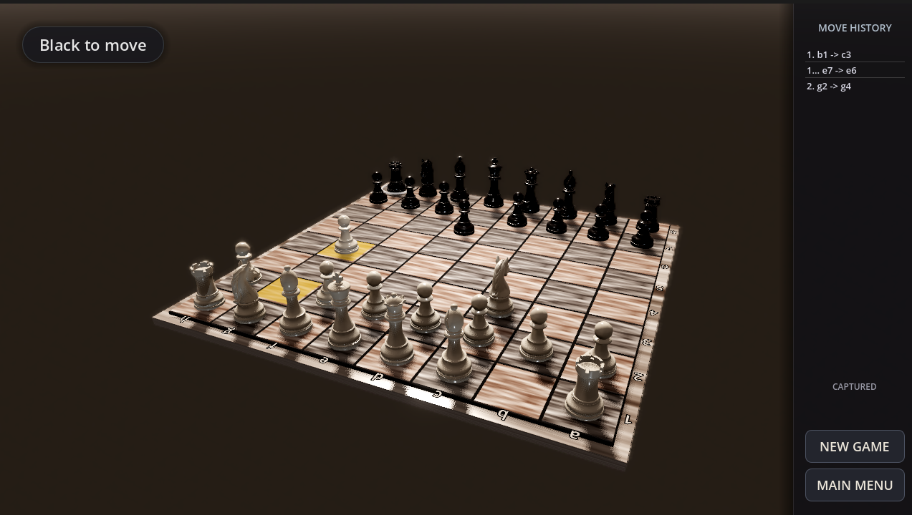
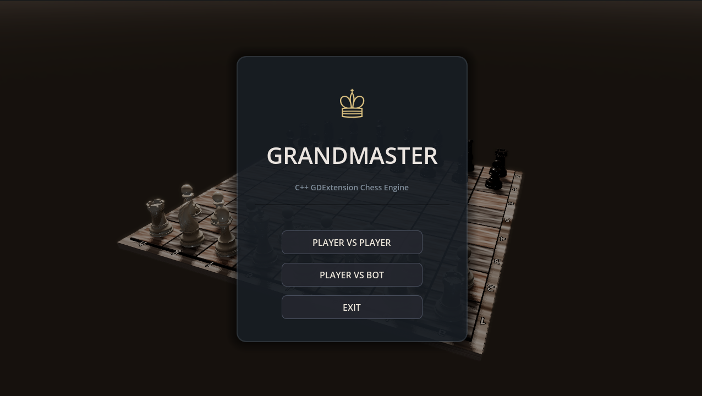
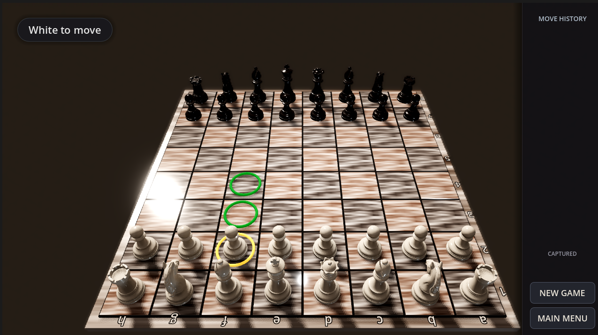
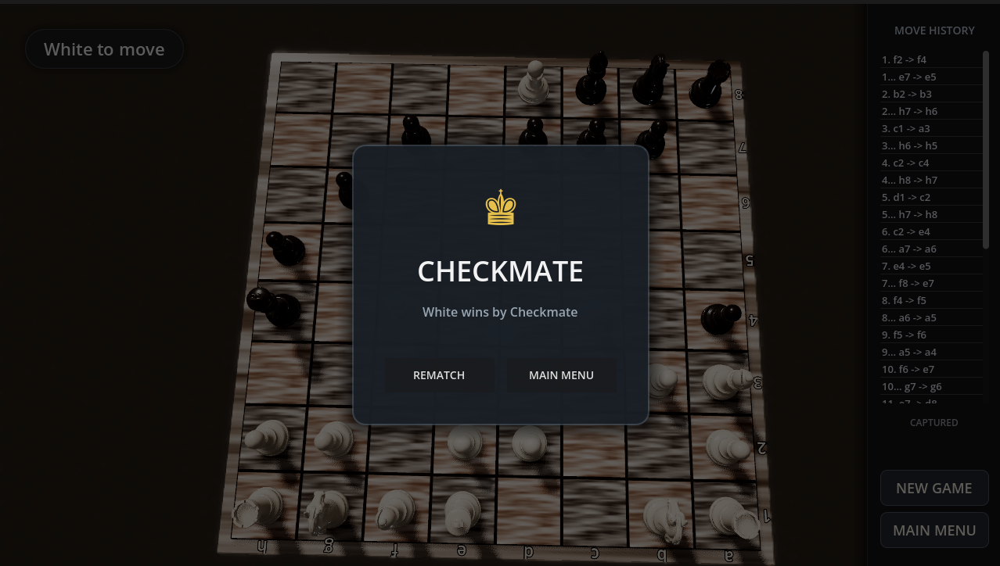
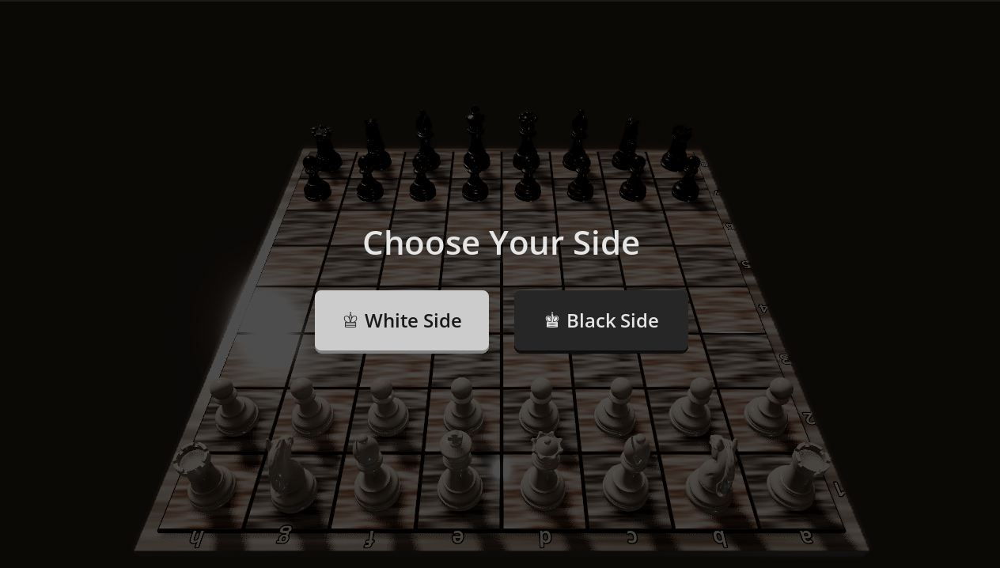

<div align="center">
  
# ♟️ Grandmaster: C++ / Godot Chess Engine

**A modern, visually stunning 3D Chess game powered by a custom C++ engine and rendered in Godot 4.**

[](https://godotengine.org)
[](https://cplusplus.com/)
[](https://opensource.org/licenses/MIT)



</div>

---

## 🌟 Overview

**Grandmaster** is a fully functional, high-performance 3D chess game. It combines the raw computational speed of a custom-built **C++ Backend** with the visual polish and modern rendering capabilities of **Godot 4**. 

Whether you want to play a local match against a friend or test your skills against the built-in Minimax AI, the game provides a premium, responsive, and cinematic experience.

### ✨ Key Features
- **High-Performance C++ Engine:** Move generation, validation, and AI logic are completely handled by a compiled C++ core, ensuring lightning-fast evaluations.
- **Minimax AI Bot:** Play against the computer across 3 difficulty levels (Easy, Medium, Hard).
- **Cinematic 3D Visuals:** A sleek, dark-themed 3D environment with procedural marble/obsidian materials, ambient lighting, and smooth camera interpolations.
- **Dynamic Camera POV:** The camera elegantly swoops across the board depending on which color you choose to play.
- **GDExtension Integration:** The C++ backend communicates seamlessly with Godot via a native GDExtension `.dll`, providing maximum performance without the overhead of GDScript.

---

## 📸 Screenshots

<p align="center">
  
  
</p>
<p align="center">
  
  
</p>

---

## 🏗️ Technical Architecture

The project is split into two distinct layers that communicate via `godot-cpp`:

1. **`backend/` (C++)**: 
   - Contains the core chess logic (`Board`, `Piece`, `Move`, `Game`, `Square`).
   - Implements the `Bot` class, utilizing a Minimax algorithm with Alpha-Beta pruning and material evaluation.
   - 100% engine-agnostic and unit-tested using `doctest`.
2. **`bridge/` (C++)**: 
   - The GDExtension wrapper (`chess_engine.cpp`) that binds the C++ logic to Godot, exposing methods like `play_move` and `get_legal_moves` to GDScript.
3. **`game/` (Godot 4)**: 
   - Contains all the visual assets, UI (HUD, Main Menu), audio, and the 3D scene (`main.tscn`).
   - Handles mouse raycasting, animations, and camera logic entirely in GDScript.

---

## 🚀 Installation & Build Guide

Because this project relies on a compiled C++ extension, you will need to build the native binaries before opening the game in Godot.

### Prerequisites
- [Godot 4.3+](https://godotengine.org/download/)
- [Python 3.6+](https://www.python.org/downloads/) (required for SCons)
- **SCons** build system (`pip install scons`)
- A C++ Compiler:
  - **Windows:** Visual Studio (MSVC)
  - **Mac/Linux:** Clang or GCC

### 1. Clone the Repository
Clone this repository and ensure you pull the `godot-cpp` submodule:
```bash
git clone --recursive https://github.com/YOUR_USERNAME/chess_project.git
cd chess_project
```

### 2. Build the C++ Backend (GDExtension)
Open your terminal in the project root and run SCons to compile the extension.
```bash
python -m SCons gdextension
```
*Note: Make sure the Godot Editor is closed while building, as Windows will lock the `.dll` file if the game is open!*

### 3. Run the Game
Once the build finishes successfully (and the `game/bin/chess_engine.dll` is created), simply open the `game/project.godot` file using the Godot Editor and hit **Play (F5)**!

---

## 🎮 How to Play

- **Left Click:** Select a piece to see its valid moves, then click a highlighted square to move it.
- **Right Click & Drag:** Freely rotate the 3D camera around the board.
- **Scroll Wheel:** Zoom the camera in and out.
- **Main Menu:** Choose between PvP or Play vs Bot (Easy, Medium, Hard). Select your side (White or Black) and the camera will automatically orient itself to your perspective!

---

## 📜 Credits & Assets
- **Programming & Design:** Tal Schneider and Ariel Prace
- **3D Chess Pieces:** Generated with polyy.ai ("3D Chess Pieces Pack") - [CC0 1.0 Universal](https://creativecommons.org/publicdomain/zero/1.0/)
- **Built with:** [Godot Engine](https://godotengine.org) & [godot-cpp](https://github.com/godotengine/godot-cpp)

---

<div align="center">
  <i>If you found this project interesting, feel free to leave a ⭐ on the repository!</i>
</div>
